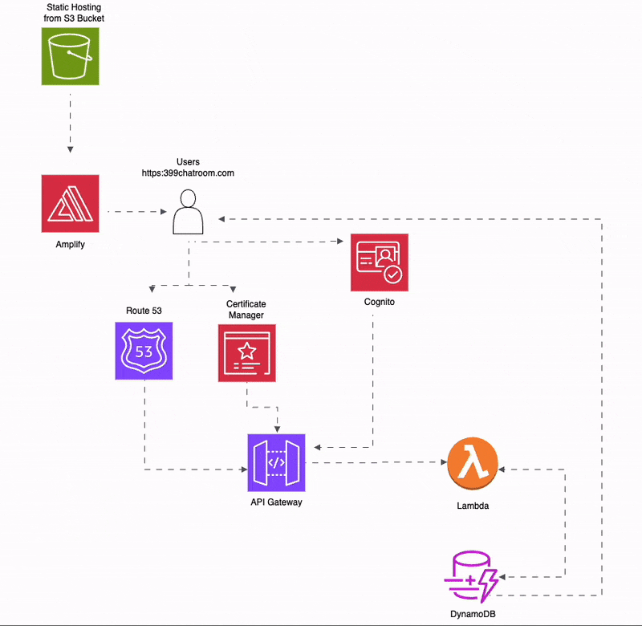

# Serverless Chatroom Infrastructure

This repository provides a complete serverless chatroom application infrastructure using AWS services. It includes all necessary infrastructure-as-code templates and implementation code for immediate deployment. The architecture diagram above illustrates how the various AWS services interact to deliver a scalable, real-time chat solution.

Our implementation leverages several AWS services:
- Amazon Cognito manages user authentication and authorization
- API Gateway provides both REST and WebSocket endpoints
- AWS Lambda functions process authentication and message handling
- Amazon DynamoDB stores chat messages and connection information
- Amazon S3 hosts the static website content

## Architecture Justification

Our architecture choices were driven by specific requirements and benefits:

1. **Serverless Architecture**
   - Eliminates server management
   - Auto-scaling capabilities
   - Pay-per-use pricing model
   - High availability

2. **AWS Cognito**
   - Managed authentication service
   - OAuth 2.0 and JWT token support
   - Built-in user management
   - Secure and scalable

3. **API Gateway (REST & WebSocket)**
   - Real-time bidirectional communication
   - RESTful API for CRUD operations
   - Built-in authorization
   - Request/response validation

4. **DynamoDB**
   - Serverless database
   - Millisecond latency
   - Automatic scaling
   - Perfect for real-time chat data

5. **Lambda Functions**
   - Event-driven processing
   - Automatic scaling
   - Cost-effective for sporadic workloads
   - Easy integration with other AWS services

## Contributors

- **Fernando Peralta Castro** - [fpera0248](https://github.com/fpera0248)
- **Davin Glynn** - [dg25moravian](https://github.com/dg25moravian)
- **David Marrero** - [badlydrawnface](https://github.com/badlydrawnface)

## Architecture Diagram


## Architecture Flowchart


## WebSocket Integration


The WebSocket API implementation enables real-time communication through:
- Persistent connections for immediate message delivery
- Efficient broadcast capabilities to connected clients
- Session management through DynamoDB
- Secure message routing and delivery

## Repository Contents

```
chatroom-infrastructure/
├── cloudformation/
│   └── template.yaml       # CloudFormation infrastructure template
├── lambda/
│   ├── getChatMessages/   # Message retrieval function
│   └── store-message/     # Message storage function
├── website/               # Static website files
│   ├── index.html        # Main application page
│   ├── css/              # Styling
│   └── js/               # Frontend implementation
└── README.md
```

## Prerequisites

The deployment process requires:
- An AWS Account with administrator access
- AWS CLI installed and configured
- A domain name for the application (optional)
- Node.js and npm for local development
- Python 3.9+ for Lambda function testing

## Setup

1. Clone the repository:
```bash
git clone <repository-url>
cd chatroom-infrastructure
```

2. Install dependencies:
```bash
# Install AWS CLI if not already installed
curl "https://awscli.amazonaws.com/awscli-exe-linux-x86_64.zip" -o "awscliv2.zip"
unzip awscliv2.zip
sudo ./aws/install

# Configure AWS CLI
aws configure
```

## Deployment Options

### Local Development Deployment

1. Set up local environment:
```bash
# Install required Python packages
pip install -r lambda/requirements.txt

# Install node dependencies
cd website
npm install
cd ..
```

2. Run the frontend locally:
```bash
cd website
python -m http.server 8000
```

3. Test Lambda functions locally using AWS SAM:
```bash
# Install AWS SAM CLI
brew install aws-sam-cli  # For macOS
# or
pip install aws-sam-cli   # Using pip

# Test Lambda functions
sam local invoke getChatMessages
sam local invoke storeMessage
```

### AWS CLI Deployment (Local Machine)

1. Deploy AWS infrastructure:
```bash
aws cloudformation create-stack \
  --stack-name chatroom-app \
  --template-body file://cloudformation/template.yaml \
  --capabilities CAPABILITY_IAM
```

2. Get stack outputs and configure application:
```bash
# Get CloudFormation outputs
aws cloudformation describe-stacks \
  --stack-name chatroom-app \
  --query 'Stacks[0].Outputs' \
  --output json > stack-outputs.json
```

3. Update the frontend main.js with CloudFormation outputs:
```bash
# Get required values
USER_POOL_ID=$(aws cloudformation describe-stacks --stack-name chatroom-app --query 'Stacks[0].Outputs[?OutputKey==`UserPoolId`].OutputValue' --output text)
CLIENT_ID=$(aws cloudformation describe-stacks --stack-name chatroom-app --query 'Stacks[0].Outputs[?OutputKey==`ClientId`].OutputValue' --output text)
COGNITO_DOMAIN=$(aws cloudformation describe-stacks --stack-name chatroom-app --query 'Stacks[0].Outputs[?OutputKey==`UserPoolDomainName`].OutputValue' --output text)
API_ENDPOINT=$(aws cloudformation describe-stacks --stack-name chatroom-app --query 'Stacks[0].Outputs[?OutputKey==`WebApiEndpoint`].OutputValue' --output text)

# Replace placeholders in main.js
sed -i "s|YOUR_USER_POOL_ID|$USER_POOL_ID|g" website/js/main.js
sed -i "s|YOUR_CLIENT_ID|$CLIENT_ID|g" website/js/main.js
sed -i "s|YOUR_COGNITO_DOMAIN|$COGNITO_DOMAIN|g" website/js/main.js
sed -i "s|YOUR_STORE_MESSAGE_ENDPOINT|$API_ENDPOINT/messages|g" website/js/main.js
sed -i "s|YOUR_GET_MESSAGES_ENDPOINT|$API_ENDPOINT/messages|g" website/js/main.js
```

4. Update Lambda functions with environment variables and deploy:
```bash
# Get website domain
WEBSITE_URL=$(aws cloudformation describe-stacks --stack-name chatroom-app --query 'Stacks[0].Outputs[?OutputKey==`WebsiteURL`].OutputValue' --output text)
TABLE_NAME=$(aws cloudformation describe-stacks --stack-name chatroom-app --query 'Stacks[0].Outputs[?OutputKey==`MessagesTableName`].OutputValue' --output text)

# Update Lambda functions
aws lambda update-function-configuration \
  --function-name chatroom-app-getChatMessages \
  --environment "Variables={ALLOWED_ORIGIN=$WEBSITE_URL,TABLE_NAME=$TABLE_NAME}"

aws lambda update-function-configuration \
  --function-name chatroom-app-storeMessage \
  --environment "Variables={ALLOWED_ORIGIN=$WEBSITE_URL,TABLE_NAME=$TABLE_NAME}"

# Package and deploy Lambda functions
cd lambda
zip -r ../getChatMessages.zip getChatMessages/
zip -r ../store-message.zip store-message/
aws s3 cp getChatMessages.zip s3://your-lambda-bucket/
aws s3 cp store-message.zip s3://your-lambda-bucket/
cd ..
```

5. Deploy frontend:
```bash
cd website
aws s3 sync . s3://your-bucket-name/
```

### AWS CloudShell Deployment

1. Open AWS CloudShell in your AWS Console

2. Clone and configure the repository:
```bash
git clone <repository-url>
cd chatroom-infrastructure
```

3. Deploy infrastructure:
```bash
aws cloudformation create-stack \
  --stack-name chatroom-app \
  --template-body file://cloudformation/template.yaml \
  --capabilities CAPABILITY_IAM
```

4. Configure and deploy (CloudShell version):
```bash
# Get and store CloudFormation outputs
aws cloudformation describe-stacks \
  --stack-name chatroom-app \
  --query 'Stacks[0].Outputs' \
  --output json > stack-outputs.json

# Set environment variables
export USER_POOL_ID=$(aws cloudformation describe-stacks --stack-name chatroom-app --query 'Stacks[0].Outputs[?OutputKey==`UserPoolId`].OutputValue' --output text)
export CLIENT_ID=$(aws cloudformation describe-stacks --stack-name chatroom-app --query 'Stacks[0].Outputs[?OutputKey==`ClientId`].OutputValue' --output text)
export COGNITO_DOMAIN=$(aws cloudformation describe-stacks --stack-name chatroom-app --query 'Stacks[0].Outputs[?OutputKey==`UserPoolDomainName`].OutputValue' --output text)
export API_ENDPOINT=$(aws cloudformation describe-stacks --stack-name chatroom-app --query 'Stacks[0].Outputs[?OutputKey==`WebApiEndpoint`].OutputValue' --output text)
export WEBSITE_URL=$(aws cloudformation describe-stacks --stack-name chatroom-app --query 'Stacks[0].Outputs[?OutputKey==`WebsiteURL`].OutputValue' --output text)
export TABLE_NAME=$(aws cloudformation describe-stacks --stack-name chatroom-app --query 'Stacks[0].Outputs[?OutputKey==`MessagesTableName`].OutputValue' --output text)

# Update configurations and deploy
sed -i "s|YOUR_USER_POOL_ID|$USER_POOL_ID|g" website/js/main.js
sed -i "s|YOUR_CLIENT_ID|$CLIENT_ID|g" website/js/main.js
sed -i "s|YOUR_COGNITO_DOMAIN|$COGNITO_DOMAIN|g" website/js/main.js
sed -i "s|YOUR_STORE_MESSAGE_ENDPOINT|$API_ENDPOINT/messages|g" website/js/main.js
sed -i "s|YOUR_GET_MESSAGES_ENDPOINT|$API_ENDPOINT/messages|g" website/js/main.js

# Deploy Lambda functions
cd lambda
zip -r ../getChatMessages.zip getChatMessages/
zip -r ../store-message.zip store-message/
aws s3 cp getChatMessages.zip s3://your-lambda-bucket/
aws s3 cp store-message.zip s3://your-lambda-bucket/
cd ..

# Deploy frontend
cd website
aws s3 sync . s3://your-bucket-name/
```

## Testing

1. Get your deployed website URL:
```bash
aws cloudformation describe-stacks \
  --stack-name chatroom-app \
  --query 'Stacks[0].Outputs[?OutputKey==`WebsiteURL`].OutputValue' \
  --output text
```

2. Open the URL in your browser
3. Create an account and test the chat functionality

## Cleanup

1. Empty S3 buckets:
```bash
aws s3 rm s3://your-bucket-name --recursive
aws s3 rm s3://your-lambda-bucket --recursive
```

2. Delete CloudFormation stack:
```bash
aws cloudformation delete-stack --stack-name chatroom-app
```
