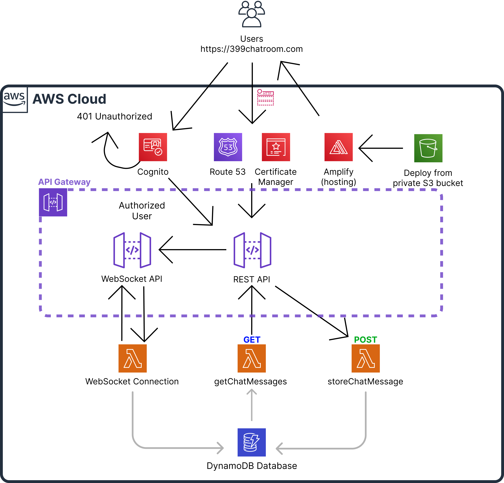
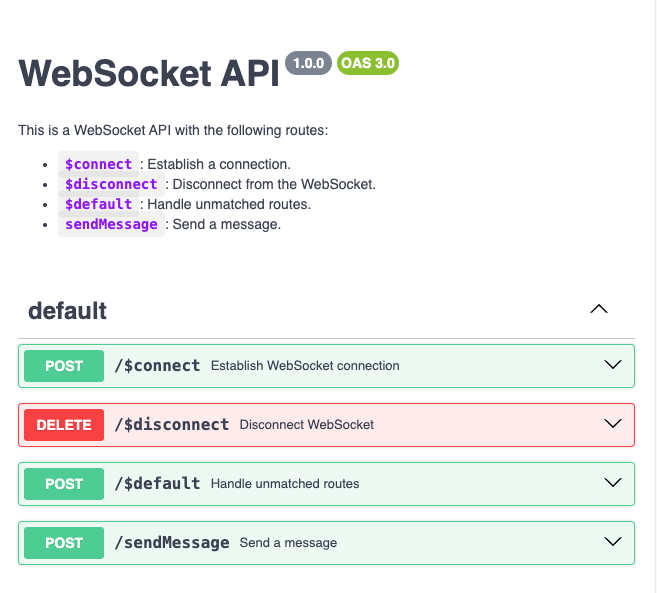

# AWS Serverless Chatroom Infrastructure

## Architecture Overview


This serverless chat application demonstrates a modern cloud architecture using various AWS services. The infrastructure is defined as code using AWS CloudFormation, enabling consistent and repeatable deployments.

## Core Components

### Amazon Cognito Authentication
The application implements secure user authentication through Amazon Cognito, providing:

- Email-based user authentication
- Integration with Google as an external identity provider
- JSON Web Token (JWT) issuance for API security
- Comprehensive user management capabilities
- Secure token handling with separate ID, Access, and Refresh tokens

### WebSocket API Integration


The WebSocket API enables real-time communication features:
- Persistent connections for immediate message delivery
- Efficient broadcast capabilities to connected clients
- Connection management through DynamoDB
- Secure message routing and delivery

## Deployment Instructions

### Prerequisites

1. AWS Account with administrative access
2. AWS CLI installed and configured
3. S3 bucket for Lambda function storage
4. Node.js and Python installed locally
5. Basic understanding of AWS services and CloudFormation

### Initial Setup

1. Clone the Repository
```bash
git clone https://github.com/your-username/chatroom-infrastructure.git
cd chatroom-infrastructure
```

2. Create Configuration File
Create `params.json` with your specific settings:
```json
[
  {
    "ParameterKey": "Environment",
    "ParameterValue": "dev"
  },
  {
    "ParameterKey": "ProjectName",
    "ParameterValue": "my-chatroom"
  },
  {
    "ParameterKey": "DomainName",
    "ParameterValue": "your-domain.com"
  }
]
```

### Lambda Function Preparation

1. Token Exchange Function Setup
```bash
mkdir -p lambda/token-exchange
cd lambda/token-exchange
npm init -y
# Add your token exchange implementation
cat << EOF > index.js
exports.handler = async (event) => {
    // Token exchange implementation
    // Refer to provided example code
};
EOF
zip -r ../../token-exchange.zip .
```

2. Message Handler Function Setup
```bash
mkdir -p lambda/get-messages
cd lambda/get-messages
# Add message handling implementation
cat << EOF > getChatMessagesPython.py
def lambda_handler(event, context):
    # Message handling implementation
    # Refer to provided example code
    pass
EOF
zip -r ../../get-messages.zip .
```

### Infrastructure Deployment

1. Create Lambda Code Bucket
```bash
export BUCKET_NAME="my-chatroom-lambda-dev"
aws s3 mb s3://${BUCKET_NAME}
aws s3 cp token-exchange.zip s3://${BUCKET_NAME}/
aws s3 cp get-messages.zip s3://${BUCKET_NAME}/
```

2. Deploy CloudFormation Stack
```bash
aws cloudformation create-stack \
  --stack-name my-chatroom-dev \
  --template-body file://template.yaml \
  --parameters file://params.json \
  --capabilities CAPABILITY_IAM CAPABILITY_NAMED_IAM
```

3. Monitor Deployment
```bash
aws cloudformation describe-stacks \
  --stack-name my-chatroom-dev \
  --query 'Stacks[0].Outputs'
```

## Post-Deployment Configuration

### Cognito Setup

1. Configure User Pool
   - Access AWS Cognito Console
   - Locate your created User Pool
   - Configure authentication providers if using Google integration
   - Set up email verification settings

2. Client Application Settings
   - Note the Client ID and Client Secret
   - Configure allowed OAuth flows
   - Set callback and logout URLs

### WebSocket API Configuration

1. Enable API Gateway WebSocket Features
   - Configure route selection expressions
   - Set up integration responses
   - Enable CloudWatch logging

2. Connection Management
   - Verify DynamoDB table creation
   - Test connection handling
   - Configure message routing

## Security Considerations

1. Authentication and Authorization
   - Implement proper token validation
   - Use appropriate CORS settings
   - Regular secret rotation
   - Implement least privilege access

2. Data Protection
   - Enable encryption at rest
   - Secure transport layer encryption
   - Implement message validation
   - Regular security audits

## Monitoring and Maintenance

1. CloudWatch Integration
   - Set up metric alarms
   - Configure log retention
   - Monitor API usage
   - Track connection statistics

2. Performance Optimization
   - Adjust DynamoDB capacity
   - Monitor Lambda execution times
   - Optimize WebSocket connections
   - Regular performance testing

## Cost Management

1. Resource Optimization
   - Use appropriate DynamoDB capacity modes
   - Monitor API Gateway usage
   - Optimize Lambda memory allocation
   - Regular cost analysis

2. Cost Control
   - Set up AWS Budgets
   - Monitor usage patterns
   - Implement auto-scaling
   - Regular cost reviews

## Troubleshooting Guide

1. Common Issues
   - Connection handling errors
   - Token validation failures
   - DynamoDB capacity issues
   - Lambda timeout problems

2. Debug Procedures
   - Check CloudWatch logs
   - Verify IAM permissions
   - Test API endpoints
   - Validate WebSocket connections

## Clean Up Resources

Remove all created resources when no longer needed:
```bash
aws cloudformation delete-stack --stack-name my-chatroom-dev
```

## Additional Resources

- [AWS Cognito Documentation](https://docs.aws.amazon.com/cognito/)
- [API Gateway WebSocket API Documentation](https://docs.aws.amazon.com/apigateway/)
- [DynamoDB Developer Guide](https://docs.aws.amazon.com/amazondynamodb/)
- [Lambda Developer Guide](https://docs.aws.amazon.com/lambda/)

For additional support or to report issues, please open a GitHub issue in the repository.
